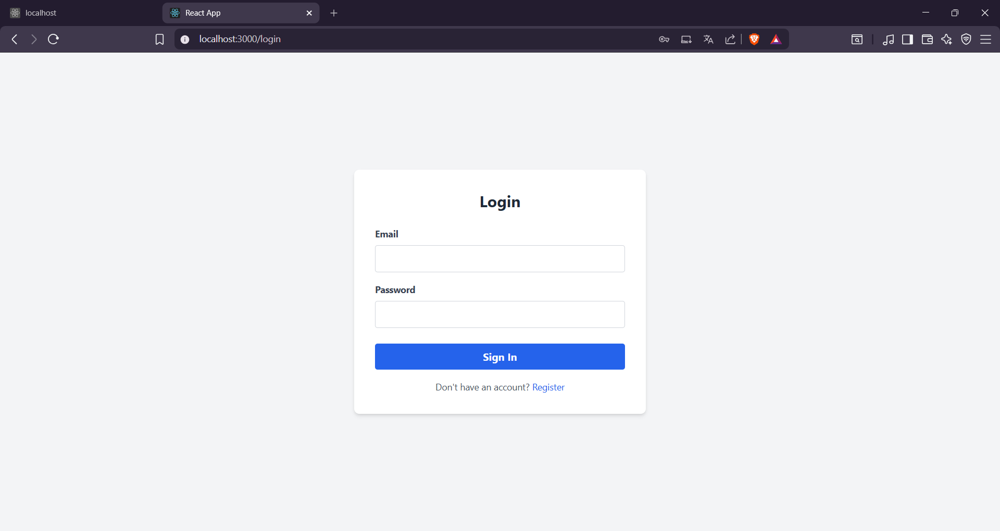
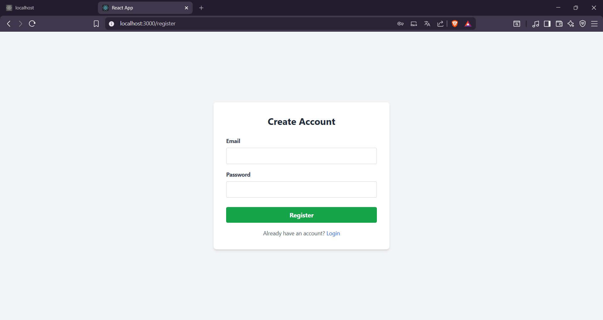
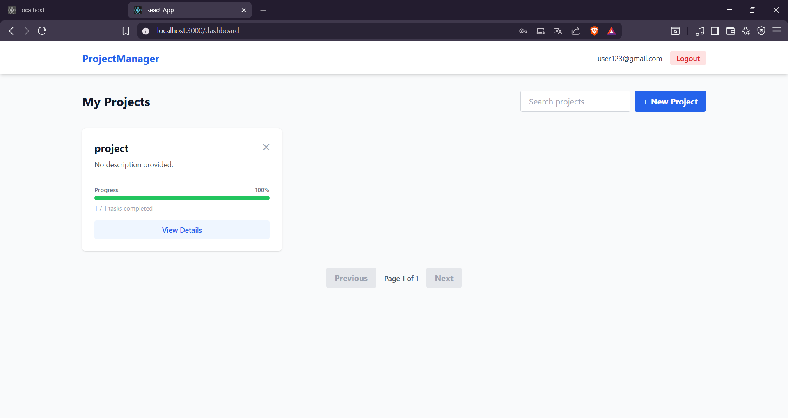
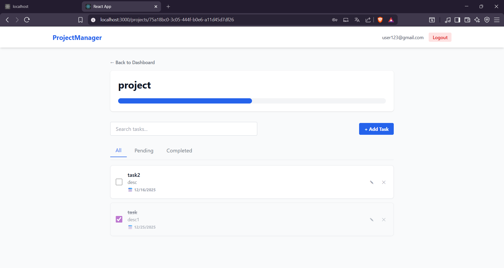
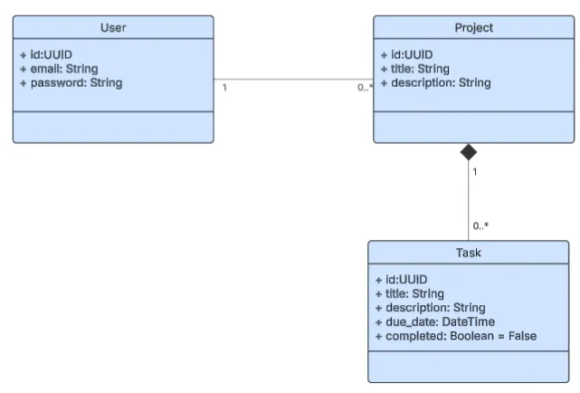

# 🚀 Project Manager App

A robust Full-Stack application for managing projects and tasks, built with **Spring Boot 3** and **React**. This application features secure authentication, real-time progress tracking, and efficient data handling.

---

## 📹 Demo Video

**[https://drive.google.com/file/d/16Lr5XB5Hbkgojx7E4ifmzTTaovAM9gaT/view?usp=sharing]**
_(Please watch the video for a 2-minute walkthrough of the features and code structure)_

---

## 🛠️ Tech Stack

### Backend

- **Java 17 / 21**
- **Spring Boot 3** (Web, Security, Data JPA, Validation)
- **MySQL 8.0** (Database)
- **JWT** (Stateless Authentication)
- **Maven** (Build Tool)

### Frontend

- **React.js** (Hooks, Context API)
- **Tailwind CSS** (Styling)
- **Axios** (API Client with Interceptors)
- **React Router** (Navigation)

---

## ✨ Features implemented

### ✅ Functional Requirements

1.  **Authentication:**
    - User Registration & Login.
    - Stateless **JWT** (JSON Web Token) security.
    - Protected Routes (Dashboard/Details) accessible only after login.
      
      
2.  **Project Management:**
    - Create new projects.
    - List projects with **Pagination** (Page size: 6).
    - **Search Projects** by title.
    - Delete projects.
      
3.  **Task Management:**
    - Add tasks to a project.
    - **Full CRUD:** Create, Read, Update (Edit details), Delete.
    - Mark tasks as **Completed/Incomplete** (Updates progress bar).
    - **Filter Tasks** (All / Pending / Completed).
    - **Search Tasks** within a project.
      
4.  **Real-Time Progress:**
    - Dynamic progress bar (0-100%) calculated based on completed tasks.
    - Visual indicators for overdue tasks.

### 🌟 Bonus Features

- **Docker Support:** `docker-compose.yml` included for instant database setup.
- **Unit Tests:** Backend Service tests included (`TaskServiceTest`).
- **Pagination & Search:** Implemented on the Dashboard.
- **Clean Architecture:**
  - Solved **N+1 Select Problem** using `@EntityGraph` in JPA.
  - Global Exception Handling (`@RestControllerAdvice`).
  - DTO Pattern for clean API contracts.

---

## 🚀 Getting Started

### Prerequisites

- Java 17 or higher
- Node.js & npm
- MySQL (or Docker)

### Option 1: Run with Docker (Recommended for DB)

If you have Docker installed, you can spin up the database instantly.

```bash
docker-compose up -d
```

_This starts MySQL on port `3307` and Adminer on `8081`._

### Option 2: Run with Local MySQL

1.  Open your MySQL terminal/workbench.
2.  Create the database:
    ```sql
    CREATE DATABASE project_manager;
    ```
3.  Update `backend/src/main/resources/application.properties` with your credentials:
    ```properties
    spring.datasource.username=YOUR_USER
    spring.datasource.password=YOUR_PASSWORD
    ```

---

## 🖥️ Running the Application

### 1\. Backend (Spring Boot)

Open a terminal in the `backend` folder:

```bash
cd backend
# Run the application
./mvnw spring-boot:run
```

_The server will start on `http://localhost:8080`._

### 2\. Frontend (React)

Open a new terminal in the `frontend` folder:

```bash
cd frontend
# Install dependencies
npm install

# Start the development server
npm start
```

_The application will open at `http://localhost:3000`._

---

## 🧪 Running Tests

To run the backend unit tests:

```bash
cd backend
./mvnw clean test
```

---

## 📂 Project Structure

```text
root/
├── backend/                 # Spring Boot Application
│   ├── src/main/java/com/projectmanager/backend/
│   │   ├── config/          # Security & CORS config
│   │   ├── controller/      # API Endpoints
│   │   ├── dto/             # Data Transfer Objects
│   │   ├── exception/       # Global Error Handling
│   │   ├── model/           # JPA Entities
│   │   ├── repository/      # DB Access (EntityGraph)
│   │   ├── security/        # JWT Filters & Logic
│   │   └── service/         # Business Logic
│   └── src/test/            # JUnit Tests
│
├── frontend/                # React Application
│   ├── src/
│   │   ├── api/             # Axios Config
│   │   ├── components/      # Reusable UI (Navbar, ProjectCard)
│   │   ├── context/         # AuthContext (State Management)
│   │   ├── pages/           # Login, Dashboard, ProjectDetails
│   │   └── App.js           # Routing
│
└── docker-compose.yml       # Container orchestration
```

## 

## 💡 Technical Decisions

1.  **EntityGraphs:** Used in `ProjectRepository` to fetch Projects and Tasks in a single query, preventing performance issues (N+1 problem) when calculating progress.
2.  **Stateless Auth:** Implemented using a custom `JwtAuthFilter` to ensure scalability.
3.  **Validation:** Applied `@Valid` on DTOs and `<input required min={today}>` on Frontend to prevent bad data (e.g., past due dates).
4.  **Global Exception Handler:** Centralized error management to return clean JSON error messages to the React frontend.
